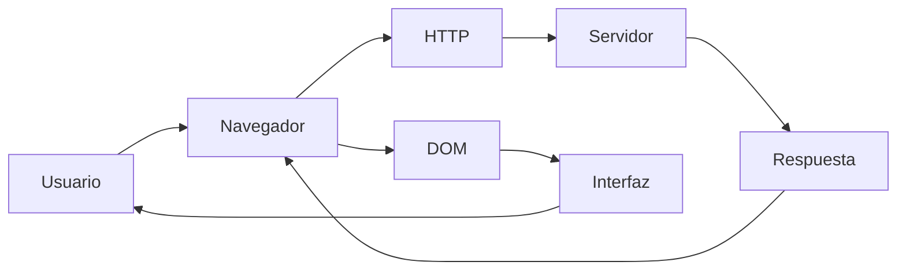
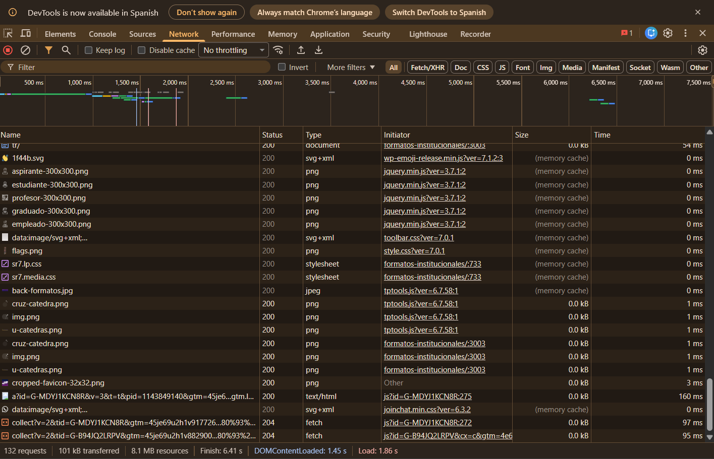
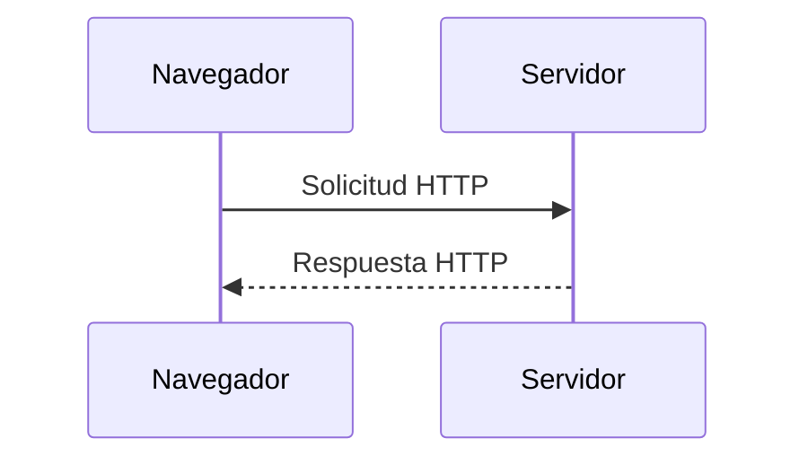
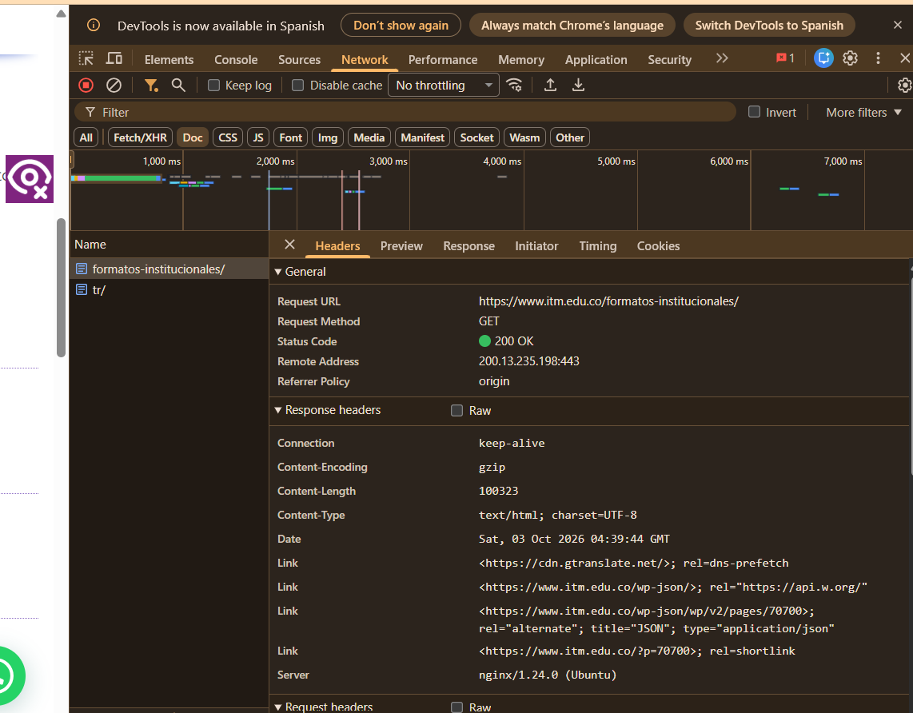
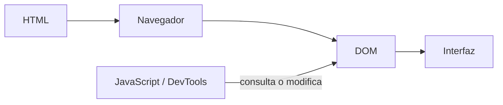
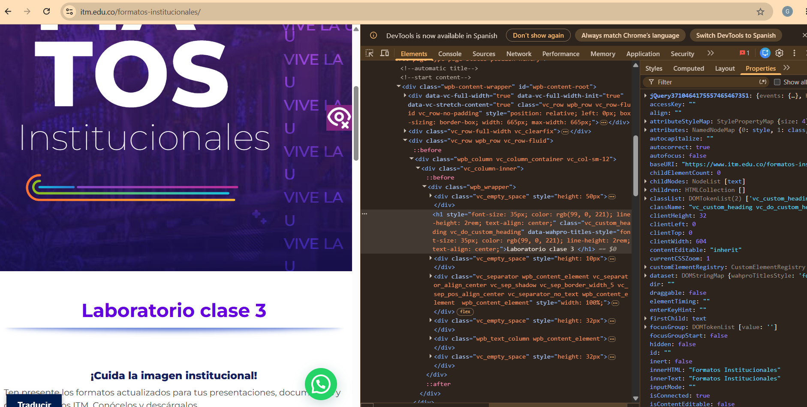
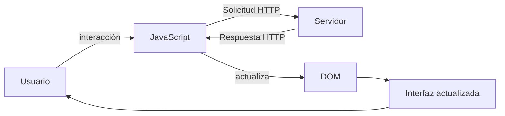
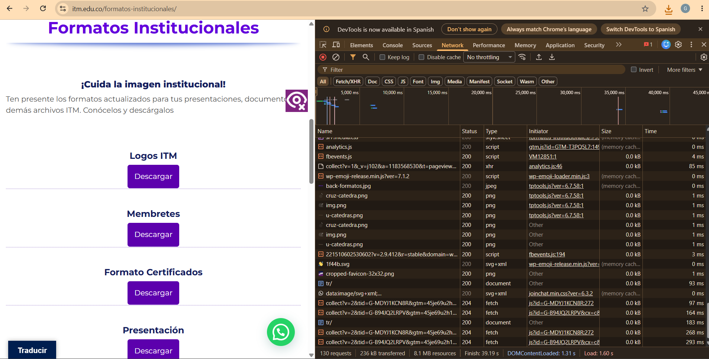
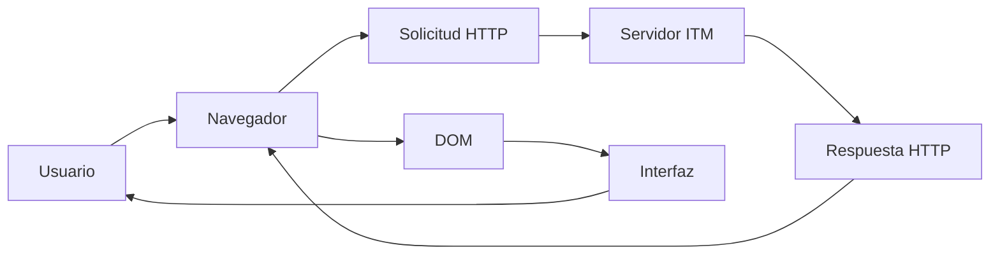

# Laboratorio 01 --- Análisis del funcionamiento de una aplicación web

> **Curso:** Aplicaciones y Servicios Web\
> **Modalidad:** Práctica de laboratorio\
> **Entrega:** Repositorio GitHub --- archivo `README.md`\
> **Evidencias:** Carpeta `evidencias/`

------------------------------------------------------------------------

## Objetivo de la práctica

Analizar el funcionamiento de una aplicación web real mediante las
herramientas de desarrollo del navegador, identificando los recursos
cargados, las solicitudes y respuestas HTTP, la estructura DOM y las
interacciones entre cliente y servidor.

## Resultado esperado

Al finalizar la práctica, el estudiante deberá poder reconstruir y
documentar el flujo observado entre:



> El diagrama anterior representa los **componentes que serán
> analizados**. El diagrama final de la práctica deberá ser construido
> por el estudiante a partir de sus propias observaciones.

------------------------------------------------------------------------

# 1. Preparación del entorno

1.  Ingrese a la aplicación web indicada por el docente.
2.  Abra las **herramientas de desarrollo** del navegador.
3.  Identifique las herramientas **Red / Network** y **Elementos /
    Elements**.
4.  Cree la siguiente estructura dentro del repositorio:

``` text
laboratorio-01/
├── README.md
└── evidencias/
```

El archivo `README.md` será el informe de la práctica. La carpeta
`evidencias/` contendrá las capturas utilizadas para sustentar los
resultados.

------------------------------------------------------------------------

# 2. Identificación de recursos de la aplicación

Abra la herramienta **Red / Network** y recargue completamente la
aplicación.

Observe las solicitudes generadas durante la carga e identifique como
mínimo **cinco recursos**, procurando seleccionar tipos diferentes:
documento HTML, CSS, JavaScript, imágenes, fuentes u otros.

## Resultados

Complete la tabla:
             
  Recurso                    Tipo                   Dominio        Tamaño
  ---------                  ------                 ---------      --------
  formatos-institucionales/  Documento HTML         www.itm.edu.co 100323 bytes 
  sr7.lp.css                 CSS                    www.itm.edu.co Cache 
  sr7.media.css              CSS                    www.itm.edu.co Cache 
  analytics.js               JavaScript             www.itm.edu.co Cache 
  back-formatos.jpg          Imagen JPG             www.itm.edu.co Cache                           
                             
                             
**Total de solicitudes observadas:** `132`

## Evidencia

Guarde una captura de la pestaña Network como:

``` text
evidencias/network.png
```

Inclúyala aquí:

``` markdown

```

### Análisis

**¿Por qué una sola URL puede generar múltiples solicitudes HTTP?**

> Porque uan sola puede generar múltiples solicitudes HTTP, ya que el navegador necesita descargar diferentes recursos parar poder construir la página web. También se destaca que, además del documento principal HTML, se cargan hojas CSS, archivos JavaScript, imágenes, entre otros y así poder mostrar la interfaz completa.

------------------------------------------------------------------------

# 3. Análisis de una solicitud HTTP

En **Network**, seleccione una de las solicitudes realizadas por el
navegador, preferiblemente la correspondiente al documento principal.

Identifique la información solicitada a continuación.

  Elemento              Resultado
  --------------------- -----------
  URL                   https://www.itm.edu.co/formatos-institucionales/ 
  Método HTTP           GET
  Código de estado      200 OK
  Host / dominio        www.itm.edu.co
  Tipo de recurso       Doc HTML
  Tiempo de respuesta   54 ms

## Flujo que se está observando



## Evidencia

Guarde una captura de los detalles de la solicitud como:

``` text
evidencias/request.png
```

Inclúyala en el informe:

``` markdown

```

### Análisis

**¿Qué recurso solicitó el navegador?**

> El navegador solicitó el documento principal HTML que era para la página Formatos Institucionales del sitio ITM.

**¿Qué información permite determinar si la solicitud fue atendida
correctamente?**

> Lo que permite identificar si la solicitud fue atendida es el código de estado HTTP, por ejemplo, para este caso se identificó el código 200 OK, lo cual indica que el servidor procesó de forma correcta la petición.

------------------------------------------------------------------------

# 4. Inspección del DOM

Seleccione un elemento visible de la aplicación, por ejemplo:

-   un botón;
-   un título;
-   un enlace;
-   un campo de formulario;
-   un elemento del menú.

Utilizando **Elementos / Elements**:

1.  Localice el elemento dentro del DOM.
2.  Identifique la etiqueta HTML utilizada.
3.  Modifique temporalmente su contenido desde las herramientas de
    desarrollo.
4.  Observe el cambio producido en la interfaz.
5.  Registre la evidencia.

## Resultados

**Elemento seleccionado:** `Título - "Formatos Institucionales"`

**Etiqueta HTML:** `h1`

**Contenido original:** `Formatos Institucionales`

**Modificación realizada:** `Laboratorio clase 3`

El proceso observado puede representarse conceptualmente así:



## Evidencia

Guarde la captura como:

``` text
evidencias/dom.png
```

Inclúyala aquí:

``` markdown

```

### Análisis

**¿La modificación realizada sobre el DOM alteró permanentemente la
aplicación o los archivos almacenados en el servidor? Justifique.**

> No, la modificación que se realizó afectó directamente la representación local de la página en el navegador y los archivos almacenados no fueron modificados, teniendo en cuenta también que si se actualiza la página, esta vuelve a mostrar su contenido original.

------------------------------------------------------------------------

# 5. Análisis de una interacción dinámica

Regrese a **Network** y limpie las solicitudes registradas.

Realice una acción dentro de la aplicación que pueda generar una
interacción con el servidor, por ejemplo:

-   consultar;
-   buscar;
-   filtrar;
-   seleccionar una opción;
-   enviar información.

Observe si aparece una nueva solicitud en Network.

## Resultados

  Elemento                       Resultado
  ------------------------------ -----------
  Acción realizada               Consulta y navegación por formatos
  ¿Generó una nueva solicitud?   Sí
  URL solicitada                 https://www.itm.edu.co/formatos-institucionales/
  Método HTTP                    GET
  Código de estado               200
  Tipo de respuesta              Documento HTML y recursos asociados

## Ciclo de interacción

Utilice este esquema únicamente como referencia conceptual para
interpretar lo observado:



## Evidencia

Guarde la captura como:

``` text
evidencias/interaccion.png
```

Inclúyala aquí:

``` markdown

```

### Análisis

**Explique la relación entre la acción realizada por el usuario y la
solicitud observada.**

> La acción del usuario generó nuevas solicitudes HTTP para así poder obtener los recursos adicionales necesarios para la navegación y visualización de toda la información, lo anterior, permite cargar imágenes, scripts, etc.

------------------------------------------------------------------------

# 6. Reconstrucción del flujo observado

A partir de **sus propias evidencias**, construya un diagrama Mermaid
que represente el funcionamiento de la aplicación analizada.

El diagrama deberá incluir, cuando corresponda:

`Usuario` · `Navegador` · `JavaScript` · `Solicitud HTTP` · `Servidor` ·
`Respuesta HTTP` · `DOM` · `Interfaz`

> **No copie los diagramas anteriores.** Esta sección debe representar
> el flujo que usted pudo comprobar durante la práctica.

Reemplace el siguiente bloque con su diagrama:



------------------------------------------------------------------------

# 7. Observado vs. inferido

Una herramienta de desarrollo permite observar una parte del sistema,
pero no necesariamente todo lo que ocurre en el servidor.

Clasifique sus hallazgos:

## Elementos observados directamente

-  Solicitudes HTTP.
-  Recursos cargados por la página: HTML, CSS, JavaScript, imágenes.
-  Modificación temporal del contenido de DOM (DevTools). 

## Elementos inferidos

-  Consultas a BD utilizadas por la página. 
-  Lógica de negocio del backend.
-  Procesamiento interno del servidor.

> No presente como observado un proceso interno que las herramientas del
> navegador no permitan comprobar directamente.

------------------------------------------------------------------------

# 8. Conclusiones

Redacte **tres conclusiones técnicas** derivadas de la práctica.

1. Una página web requiere múltiples solicitudes HTTP para descargar todos los recursos necesarios para construir completamente la interfaz que se muestra.
2. Las herramientas de desarrollo permiten analizar detalladamente la comunicación entre navegador y servidor, facilitando la identificación de recursos, solicitudes y respuestas HTTP.
3. Las modificaciones realizadas sobre el DOM afectan únicamente la representación local del contenido en el navegador y no alteran los archivos almacenados en el servidor, ya que cuando se recarga vuelve a registrar la información inicial.

Las conclusiones deben explicar lo aprendido a partir de la evidencia y
no limitarse a describir las actividades realizadas.

------------------------------------------------------------------------

# 9. Entrega

La estructura final esperada es:

``` text
laboratorio-01/
├── README.md
└── evidencias/
    ├── network.png
    ├── request.png
    ├── dom.png
    └── interaccion.png
```

Antes de entregar, verifique:

-   [ ] El `README.md` se visualiza correctamente en GitHub.
-   [ ] Las imágenes se muestran dentro del README.
-   [ ] Se documentaron al menos cinco recursos.
-   [ ] Se analizó una solicitud HTTP.
-   [ ] Se identificó y modificó un elemento del DOM.
-   [ ] Se analizó una interacción de la aplicación.
-   [ ] El diagrama final corresponde a lo observado.
-   [ ] Se diferenciaron elementos observados e inferidos.
-   [ ] Se redactaron tres conclusiones técnicas.
-   [ ] Se realizó `commit` y `push` al repositorio.

------------------------------------------------------------------------

## Criterio de documentación

> **Las capturas son evidencia, no la respuesta.**

Cada evidencia debe estar acompañada por una explicación que indique
**qué se observó, qué significa y cómo se relaciona con el
funcionamiento de la aplicación web**.